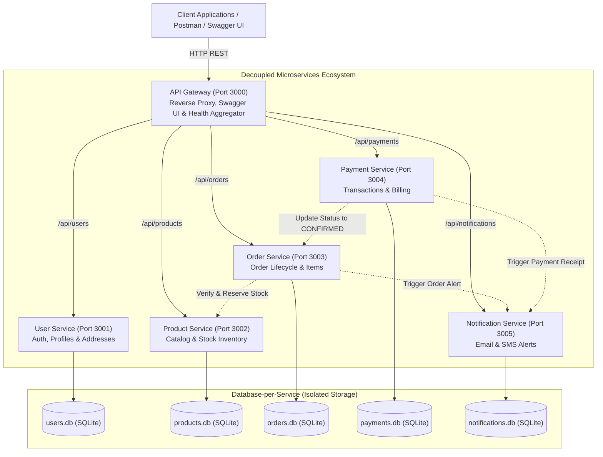
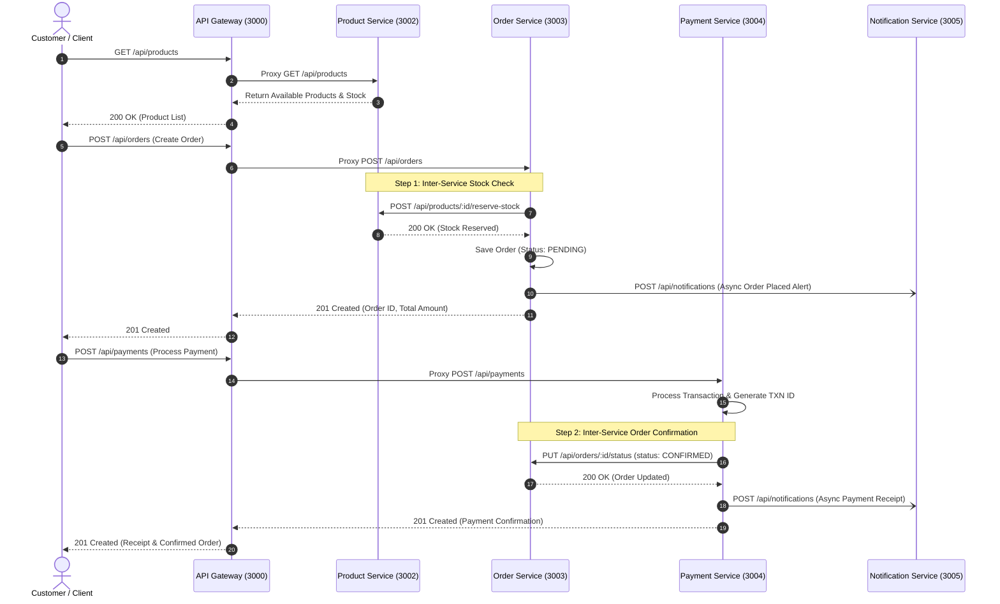

# Part A: System Design

## 1. Overall Microservice Architecture Diagram

The backend system is designed around a decoupled, event-aware **Microservices Architecture**. An **API Gateway** acts as the single entry point for clients, routing HTTP requests to five isolated backend services. Each service encapsulates its own business domain logic and maintains its own private database.

---

## 2. Identification of 5 Independent Microservices

| # | Microservice Name | Runtime Port | Primary Domain Responsibility | Private Database |
|---|---|---|---|---|
| 1 | **User Service** | `3001` | User registration, customer profiles, authentication, delivery address book | `data/users.db` |
| 2 | **Product Service** | `3002` | Product catalog, categories, SKU pricing, real-time stock reservation | `data/products.db` |
| 3 | **Order Service** | `3003` | Shopping cart conversion, order placement, status lifecycle, line items | `data/orders.db` |
| 4 | **Payment Service** | `3004` | Payment processing, multiple payment modes (UPI, Cards), transaction logs, refunds | `data/payments.db` |
| 5 | **Notification Service** | `3005` | Async communication alerts via Email, SMS, in-app notifications | `data/notifications.db` |

---

## 3. Detailed Responsibilities of Each Microservice

### 1. User Service
- Manages customer lifecycle: registration, profile modifications, deletion.
- Supports multi-address management (billing and shipping addresses) per user.
- Enforces unique email constraints and data validation.
- Exposes user lookup APIs to downstream order and billing services.

### 2. Product Service
- Maintains product catalog with names, descriptions, categories, prices, and SKUs.
- Manages category classifications.
- Provides atomic inventory reservation (`/reserve-stock`) when orders are initiated.
- Provides inventory restoration (`/restore-stock`) if orders are cancelled or aborted.

### 3. Order Service
- Orchestrates order placement by coordinating with the Product Service to verify pricing and lock inventory.
- Generates unique order numbers (`ORD-YYYY-XXXX`).
- Tracks order states: `PENDING` → `CONFIRMED` → `SHIPPED` → `DELIVERED` (or `CANCELLED`).
- Automatically triggers dispatch of notifications to customers upon placement and status changes.

### 4. Payment Service
- Simulates real-world payment gateway transactions across various payment methods (`UPI`, `CREDIT_CARD`, `DEBIT_CARD`, `NET_BANKING`).
- Generates unique transaction IDs (`TXN-YYYY-XXXX`).
- On successful payment, automatically notifies the Order Service to transition the order state to `CONFIRMED`.
- Supports refund handling and cancellation tracking.

### 5. Notification Service
- Serves as the centralized event notification logger.
- Dispatches transactional emails, SMS, and in-app alerts for system events (e.g. order placed, payment successful, shipment dispatched).
- Manages notification read/unread status.

---

## 4. End-to-End API Flow Diagram

The sequence diagram below details how the microservices communicate during a complete customer purchase journey:

