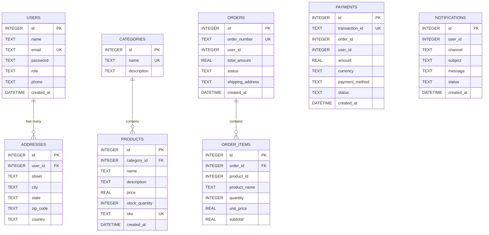

# Part B: Database Design

Each microservice implements the **Database-per-Service** architectural pattern. No microservice can directly access or query another microservice's database. This guarantees high cohesion, loose coupling, independent scalability, and autonomous deployments.

---

## 1. Microservice Database Mapping

---

## 2. Detailed Schemas per Microservice

### Database 1: `users.db` (User Service)

#### Table: `users`
| Column Name | Data Type | Constraints | Description |
|---|---|---|---|
| `id` | `INTEGER` | **PRIMARY KEY AUTOINCREMENT** | Unique identifier for user |
| `name` | `TEXT` | `NOT NULL` | Full name of the user |
| `email` | `TEXT` | `UNIQUE NOT NULL` | Login email address |
| `password` | `TEXT` | `NOT NULL` | Hashed password |
| `role` | `TEXT` | `DEFAULT 'customer'` | User role (`customer`, `admin`) |
| `phone` | `TEXT` | `NULL` | Contact phone number |
| `created_at` | `DATETIME` | `DEFAULT CURRENT_TIMESTAMP` | Timestamp of account creation |

#### Table: `addresses`
| Column Name | Data Type | Constraints | Description |
|---|---|---|---|
| `id` | `INTEGER` | **PRIMARY KEY AUTOINCREMENT** | Unique address record ID |
| `user_id` | `INTEGER` | **FOREIGN KEY (users.id) ON DELETE CASCADE** | Owner user ID reference |
| `street` | `TEXT` | `NOT NULL` | Street address / house number |
| `city` | `TEXT` | `NOT NULL` | City name |
| `state` | `TEXT` | `NOT NULL` | State / Province |
| `zip_code` | `TEXT` | `NOT NULL` | Postal / PIN code |
| `country` | `TEXT` | `DEFAULT 'India'` | Country name |

---

### Database 2: `products.db` (Product Service)

#### Table: `categories`
| Column Name | Data Type | Constraints | Description |
|---|---|---|---|
| `id` | `INTEGER` | **PRIMARY KEY AUTOINCREMENT** | Unique category ID |
| `name` | `TEXT` | `UNIQUE NOT NULL` | Category name |
| `description` | `TEXT` | `NULL` | Category description |

#### Table: `products`
| Column Name | Data Type | Constraints | Description |
|---|---|---|---|
| `id` | `INTEGER` | **PRIMARY KEY AUTOINCREMENT** | Unique product ID |
| `category_id` | `INTEGER` | **FOREIGN KEY (categories.id) ON DELETE SET NULL** | Category reference |
| `name` | `TEXT` | `NOT NULL` | Product commercial name |
| `description` | `TEXT` | `NULL` | Product specifications |
| `price` | `REAL` | `NOT NULL` | Unit selling price (INR) |
| `stock_quantity` | `INTEGER` | `NOT NULL DEFAULT 0` | Available units in inventory |
| `sku` | `TEXT` | `UNIQUE NOT NULL` | Stock Keeping Unit code |
| `created_at` | `DATETIME` | `DEFAULT CURRENT_TIMESTAMP` | Addition timestamp |

---

### Database 3: `orders.db` (Order Service)

#### Table: `orders`
| Column Name | Data Type | Constraints | Description |
|---|---|---|---|
| `id` | `INTEGER` | **PRIMARY KEY AUTOINCREMENT** | Unique internal order ID |
| `order_number` | `TEXT` | `UNIQUE NOT NULL` | Customer-facing order code |
| `user_id` | `INTEGER` | `NOT NULL` | Reference to customer |
| `total_amount` | `REAL` | `NOT NULL` | Total order value |
| `status` | `TEXT` | `DEFAULT 'PENDING'` | `PENDING`, `CONFIRMED`, `SHIPPED`, `DELIVERED`, `CANCELLED` |
| `shipping_address` | `TEXT` | `NOT NULL` | Delivery snapshot address |
| `created_at` | `DATETIME` | `DEFAULT CURRENT_TIMESTAMP` | Order timestamp |

#### Table: `order_items`
| Column Name | Data Type | Constraints | Description |
|---|---|---|---|
| `id` | `INTEGER` | **PRIMARY KEY AUTOINCREMENT** | Line item record ID |
| `order_id` | `INTEGER` | **FOREIGN KEY (orders.id) ON DELETE CASCADE** | Reference to parent order |
| `product_id` | `INTEGER` | `NOT NULL` | Reference to product |
| `product_name` | `TEXT` | `NOT NULL` | Product name at time of order |
| `quantity` | `INTEGER` | `NOT NULL` | Number of items purchased |
| `unit_price` | `REAL` | `NOT NULL` | Unit price at purchase |
| `subtotal` | `REAL` | `NOT NULL` | `quantity * unit_price` |

---

### Database 4: `payments.db` (Payment Service)

#### Table: `payments`
| Column Name | Data Type | Constraints | Description |
|---|---|---|---|
| `id` | `INTEGER` | **PRIMARY KEY AUTOINCREMENT** | Unique payment record ID |
| `transaction_id` | `TEXT` | `UNIQUE NOT NULL` | Gateway transaction reference |
| `order_id` | `INTEGER` | `NOT NULL` | Associated order ID |
| `user_id` | `INTEGER` | `NOT NULL` | Paying customer ID |
| `amount` | `REAL` | `NOT NULL` | Billed amount |
| `currency` | `TEXT` | `DEFAULT 'INR'` | Payment currency |
| `payment_method` | `TEXT` | `NOT NULL` | `CREDIT_CARD`, `DEBIT_CARD`, `UPI`, `NET_BANKING` |
| `status` | `TEXT` | `DEFAULT 'COMPLETED'` | `PENDING`, `COMPLETED`, `FAILED`, `REFUNDED` |
| `created_at` | `DATETIME` | `DEFAULT CURRENT_TIMESTAMP` | Payment timestamp |

---

### Database 5: `notifications.db` (Notification Service)

#### Table: `notifications`
| Column Name | Data Type | Constraints | Description |
|---|---|---|---|
| `id` | `INTEGER` | **PRIMARY KEY AUTOINCREMENT** | Unique notification ID |
| `user_id` | `INTEGER` | `NOT NULL` | Target recipient ID |
| `channel` | `TEXT` | `NOT NULL` | Channel (`EMAIL`, `SMS`, `IN_APP`) |
| `subject` | `TEXT` | `NOT NULL` | Message title / heading |
| `message` | `TEXT` | `NOT NULL` | Content body |
| `status` | `TEXT` | `DEFAULT 'SENT'` | `SENT`, `DELIVERED`, `READ` |
| `created_at` | `DATETIME` | `DEFAULT CURRENT_TIMESTAMP` | Dispatch timestamp |
